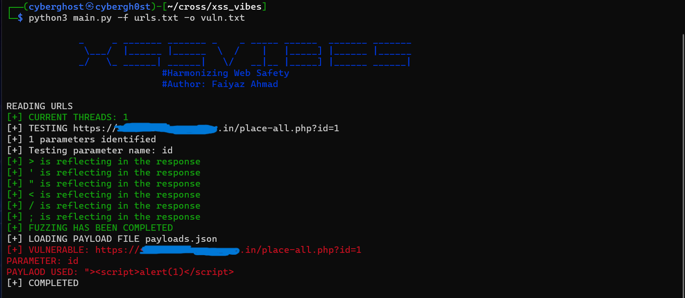

## XSS_VIBES
"Experience the Vibes of Security with xss_vibes"



### What's New?

- Added threads feature: You can now specify the threads to send multiple request at the same time!(Details given below)
- Improved Payloads: The payloads are now more accurate to the target
- Single URL Scan: Now you can scan single url by using -u flag.
- Headers: You can now add your custom headers to test authenticated or restricted endpoints!
- Improved Adder.py: Now you can payloads directly from a file! The new adder.py can automatically detect all the dangerous characters.
- WAF: This tool can now detect web application firewalls and then use specialized payloads to bypasss them.
- Custom WAF: You can choose payloads that are designed for specific waf.

### FEATURES

- Customizable: You can add your custom payload using adder.py
- Dynamic: The tool will prioritize the payloads based on the target's behavior
- Scalable: You can use this tool on bunch of links
- Speed: Send concurrent request to multiple urls

### I N S T A L L A T I O N

```
1. Clone the repository: git clone https://github.com/faiyazahmad07/xss_vibes
2. Install the requirements file: pip3 install -r requirements
3. Run the main.py file
```

### USAGE
```
python3 main.py -f <filename> -o <output>

-f: Filename that contains bunch of links
-o: Output filename in which all the vulnerable endpoints is stored
-t: No of threads[Increase the threads if you want more speed] (Max: 10)
-u: Single URL to scan.
-H: Custom Headers.(PLease use , within "" to add multiple headers)

Using  multiple  headers:
python3 main.py -f urls.txt -H "Cookies:test=123;id=asdasd, User-Agent: Mozilla/Firefox" -t 7 -o result.txt

Using  single  header:
python3 main.py -f urls.txt -H "Cookies:test=123;id=asdasd" -t 7 -o result.txt

Scanning single URL:
python3 main.py -u http://example.com/hpp/?pp=12 -o out.txt

Detect waf & scan:
python3 main.py -u http://example.com/hpp/?pp=12 -o out.txt --waf

Specify waf manually:

python3 main.py -u http://example.com/hpp/?pp=12 -o out.txt -w cloudflare

Using PIPE

cat katana.txt | python3 main.py --pipe -t 7
```

### DEMONSTRATION

[Video Link](https://www.youtube.com/watch?v=0aVTsdDwcQ8)

### CONTRIBUTORS

- [Asif Pathan](https://www.linkedin.com/in/asifpathan48/): Contributed in adding payloads
- [Kunal Dhumal](https://www.linkedin.com/in/kunal-dhumal-47356721a/): Contributed in adding payloads
- [Krishna Gupta](https://www.linkedin.com/in/iamkrishnagupta/): Developed Module
- [Sanjay](): Developed Module 
